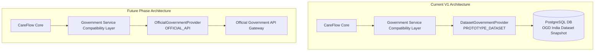

# CareFlow Architecture Specification

## 1. System Overview & Core Principle

CareFlow is a community-first healthcare coordination platform connecting Community Health Workers (CHWs), Primary Health Centres (PHCs), District Hospitals, and patient IVR hotlines.

> [!IMPORTANT]
> **Most Important Product Principle**:
> CareFlow does NOT replace existing healthcare services. CareFlow **ACCESSes** them, **CONNECTs** to them, **COORDINATEs** them, **TRACKs** the care journey, **IDENTIFIEs** gaps, and **SUPPORTs** follow-up. Existing healthcare facilities and clinicians remain fully responsible for providing actual healthcare.

---

## 2. Overall V1 Architecture Diagram

```
                     CAREFLOW
                        │
          ┌─────────────┼─────────────┐
          ▼             ▼             ▼
        Web           CHW           IVR
          │             │             │
          └─────────────┼─────────────┘
                        ▼
                  CAREFLOW CORE
                        │
             ┌──────────┼──────────┐
             ▼          ▼          ▼
        Care Journey  Care Gap   Referral
             │          │          │
             └──────────┼──────────┘
                        ▼
              GOVERNMENT SERVICE
              COMPATIBILITY LAYER
                        │
            ┌───────────┴───────────┐
            ▼                       ▼
    Prototype Dataset          Future Official
       Provider                   Provider
            │                       │
            ▼                       ▼
    Public/Official Data       Government API
```

---

## 3. Technology Verification & Honest System Stack

- **Backend API**: Java 21 + Spring Boot 3.3. REST API, Care Journey Engine, Care Gap Engine, IVR Gateway, Audit Logging.
- **Database**: PostgreSQL 16 (Runtime source of truth), H2 in-memory (Test profile).
- **Web Dashboard**: React 18 + TypeScript 5.2 + Vite 5.4. Interactive 8-step workflow runner & IVR simulator.
- **CHW Mobile**: React / Vite Web Prototype styled as mobile viewport (`CHW Mobile-Viewport Prototype`).
- **Offline Storage**: Offline workflow prototype with synchronization-state simulation.
- **IVR Telephony**: Native Java state machine supporting 5 Indian languages (`MOCK IVR DEMONSTRATION`).

---

## 4. Provider Replacement Architecture



---

## 5. Integration Terminology

- `REAL CAREFLOW API`: Core backend services executing native business logic.
- `PROTOTYPE_DATASET`: Verified public/official dataset snapshot (data.gov.in OGD India) used as temporary service provider.
- `DEMO_TRANSACTION`: Simulated external transaction for integration boundaries without live API access.
- `OFFICIAL_API`: Reserved for future authorized live Government API integrations.
