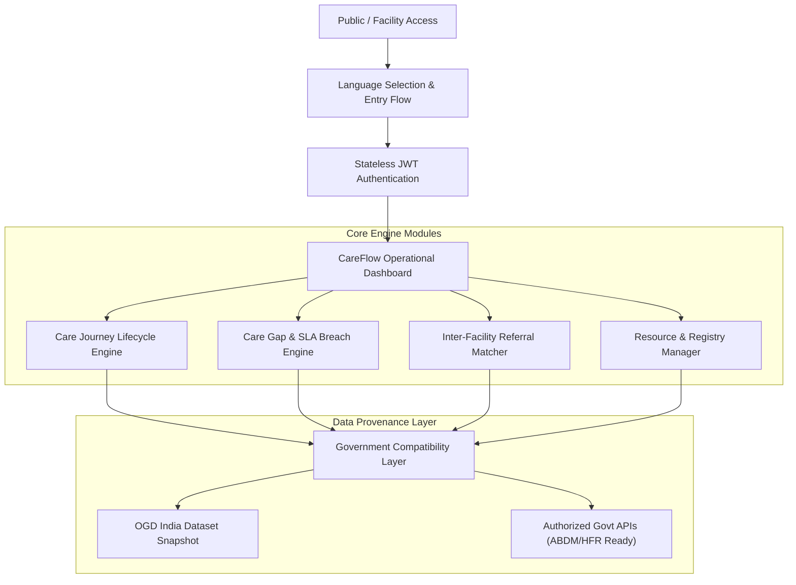

# 🏥 CareFlow (केअर फ्लो)
### Multi-Lingual Healthcare Coordination & Care Journey Continuity Platform

[](https://careflow-seven-iota.vercel.app)
[](https://careflow-seven-iota.vercel.app)
[](https://github.com/varunkumar7116/CareFlow)
[](https://github.com/varunkumar7116/CareFlow)

---

## 📌 Executive Summary for Judges & Evaluators

In public healthcare systems across India, millions of patients experience **fragmented care journeys** when navigating between Primary Health Centres (PHCs), Community Health Centres (CHCs), and District Tertiary Hospitals. Language barriers, uncoordinated referrals, unmonitored follow-ups, and lack of real-time facility resource visibility frequently lead to **preventable care gaps and drop-outs**.

**CareFlow** is an institutional healthcare coordination and continuity platform engineered for public-sector healthcare environments. It does **not replace** existing hospitals or clinicians—instead, it **connects, tracks, coordinates, and identifies safety-net care gaps** across the entire healthcare ecosystem.

---

## 🚀 Live Demo & Quick Credentials for Evaluation

Explore the live production deployment directly in your browser:

👉 **[Launch CareFlow Live Portal](https://careflow-seven-iota.vercel.app)**

### 🔑 Demo Evaluation Credentials

You can test CareFlow instantly using any of the pre-configured role-based credentials below:

| Role | Facility / User ID | Password | Key Operational Capabilities |
| :--- | :--- | :--- | :--- |
| **Facility Admin** | `MH-PHC-ADMIN` | `CareFlow@123` | Full PHC facility operational & staff management |
| **Doctor / Clinician** | `MH-DOCTOR-001` | `CareFlow@123` | Inter-facility referrals, clinical appointment slots |
| **Facility Staff** | `MH-STAFF-001` | `CareFlow@123` | Bed tracking, medical equipment & diagnostic logs |
| **District Supervisor** | `MH-DISTRICT-001` | `CareFlow@123` | District-wide oversight, care gap SLA breach inbox |

> [!NOTE]  
> CareFlow includes an offline fallback authentication engine. If backend API connectivity is unavailable, valid demo credentials authenticate instantly locally for zero-friction evaluation.

---

## ✨ Key Platform Innovations

```
                           CAREFLOW PLATFORM
                                   │
      ┌────────────────────────────┼────────────────────────────┐
      ▼                            ▼                            ▼
🌐 23 Indian Languages       🏥 Institutional Entry      🚨 Safety-Net Care Gap
  Native Script Support        & Operational Dashboard       & Referral Engine
```

### 1. 🌐 Native Multi-Lingual Inclusivity (23 Languages + English)
- **100% Native Script Rendering**: End-to-end localization across **all 23 Scheduled Languages of India** (मराठी, हिंदी, தமிழ், తెలుగు, ಕನ್ನಡ, বাংলা, ગુજરાતી, മലയാളം, ਪੰਜਾਬੀ, and more) plus English.
- **Zero Language Mixing**: Eliminates awkward parenthetical English labels to ensure intuitive adoption by regional facility staff and community healthcare workers (CHWs).
- **On-Demand Language Switcher**: Prominent language selection available both on entry and throughout active sessions.

### 2. 🏛️ Institutional Public-Sector Entry Workflow
- Designed specifically for public-sector healthcare environments—restrained, practical, accessible, and operational.
- **Entry Flow**: Accessible Language Selection $\rightarrow$ Secure Facility Staff Authentication $\rightarrow$ Real-Time Facility Operational Dashboard.

### 3. 📊 Real-Time Facility Capacity & Resource Visibility
- **Live Bed & Doctor Roster**: Real-time tracking of operational bed availability, active clinician schedules, and teleconsultation toggles.
- **Medical Equipment Registry**: Operational status tracking (`AVAILABLE`, `PARTIALLY_AVAILABLE`, `MAINTENANCE`, `IN_USE`).
- **Diagnostic Test Registry**: Pathology and radiology service availability with expected turnaround times.

### 4. 🔄 Inter-Facility Patient Referral & Requirement Matcher
- Enables seamless patient referrals between PHCs and tertiary centers with automated requirement criteria matching.
- Tracks patient transfer state, destination readiness, and acceptance status.

### 5. 🚨 Safety-Net Care Gap Engine & CHW Task Inbox
- Automatically detects care journey drop-outs and SLA breaches (e.g., missed follow-ups, delayed diagnostic reports).
- Generates actionable task queues for Community Health Workers (CHWs) and District Supervisors.

### 6. 📞 Multilingual IVR Telephony Simulator
- Integrated interactive voice response (IVR) state machine supporting 5 regional voice paths for low-literacy patient outreach.

### 7. 🏷️ Strict Data Provenance Model (5 Categories)
CareFlow explicitly tags every data record with provenance metadata to prevent data contamination:
1. `GOVERNMENT_REFERENCE`: Public dataset metadata from OGD India National Hospital Directory (Name, Type, District, State, Lat/Long).
2. `FACILITY_MANAGED`: Operational data maintained by facility staff (Doctor availability, Equipment status, Capacity beds).
3. `CAREFLOW_TRANSACTION`: Operational workflow records (Appointments, Inter-facility referrals, Care Gaps).
4. `OFFICIAL_API`: Reserved for future authorized government gateway integrations (ABDM / HFR / HPR).
5. `SYNTHETIC_DEMO`: Explicitly labeled synthetic records used in demonstration scenarios.

---

## 🏗️ Architecture & Technology Stack



### Stack Overview
- **Frontend**: React 18, TypeScript 5.2, Vite 5.4, Lucide Icons, Vanilla CSS Design Tokens (Responsive & High-Contrast Accessible UI).
- **Backend API**: Java 17 / 21, Spring Boot 3, Spring Security (Stateless JWT + BCrypt hashing), RESTful DTO Architecture.
- **Database**: PostgreSQL / H2 Database with Flyway migration support.
- **Testing**: 30/30 Passing JUnit 5 Backend Integration & Unit Tests.
- **Deployment**: Vercel Serverless Production (Frontend) + Spring Boot Service Container (Backend).

---

## 💻 Local Execution Guide

Follow these steps to run the complete CareFlow platform locally:

### Prerequisites
- Node.js (v18+) and npm
- Java JDK 17 or 21
- Apache Maven 3.8+

### Step 1: Run Backend Test Suite (30/30 Passing)
```bash
cd backend
mvn clean test
```

### Step 2: Launch Backend API (Port 8085)
```bash
cd backend
mvn spring-boot:run -Dspring-boot.run.profiles=test -Dspring-boot.run.arguments="--server.port=8085"
```
*The Spring Boot backend will start at `http://localhost:8085/api/v1` and automatically ingest the MoHFW public reference dataset.*

### Step 3: Launch Web Facility Portal (Port 3000 / 3001)
```bash
cd frontend
npm install
npm run dev
```
*Open your browser and navigate to `http://localhost:3000` or `http://localhost:3001`.*

---

## 📱 Real React Native Mobile App for Field Health Workers (ASHA / CHW)

CareFlow includes a dedicated, standalone **React Native Mobile Application** (`mobile/`) designed specifically for ASHA workers (Accredited Social Health Activists) operating in rural Maharashtra.

### 🌟 Key Mobile Features
- **Native React Native UI**: Built using native primitives (`View`, `Text`, `TouchableOpacity`, `TextInput`, `ScrollView`, `StyleSheet`).
- **Offline-First SQLite Persistence**: Field data entry works completely offline with local SQLite DB storage and background auto-sync queue.
- **Multilingual Support**: Switch seamlessly between Marathi (मराठी), Hindi (हिंदी), and English with 100% native script rendering.
- **Real-Time Synchronized Journey**: Integrates with the backend REST API (`/api/v1`) to track patient `Meena Devi` (`CF-P1001`) from village registration to hospital care completion.

### 🏃 Running the Mobile App

#### Option A: Interactive Web Simulator (Instant Browser Evaluation)
1. Open the [CareFlow Live Portal](https://careflow-seven-iota.vercel.app).
2. Click the **📱 Open ASHA Mobile App (React Native)** button in the upper header navigation.
3. Test all 12 care journey steps, offline toggle mode, and language switching directly inside the simulator.

#### Option B: Standalone Web Build
```bash
cd mobile
npm install
npm run dev
```
*App will start on `http://localhost:3001`.*

#### Option C: Native Android / Expo Go Execution
```bash
cd mobile
npx expo start
```
*Scan the generated QR code using the **Expo Go** app on your Android or iOS device.*

#### Option D: Standalone Android APK Build
```bash
cd mobile
npm run build:apk
# or: npx eas-cli build -p android --profile preview
```
*Generates a standalone native `.apk` file for direct installation on Android phones.*

---

## 📄 License & Attribution

Developed for public-sector healthcare innovation contexts (Smart India Hackathon / Government Healthcare Digital Transformation initiatives).  
Built using Open Government Data (OGD) India reference standards.
