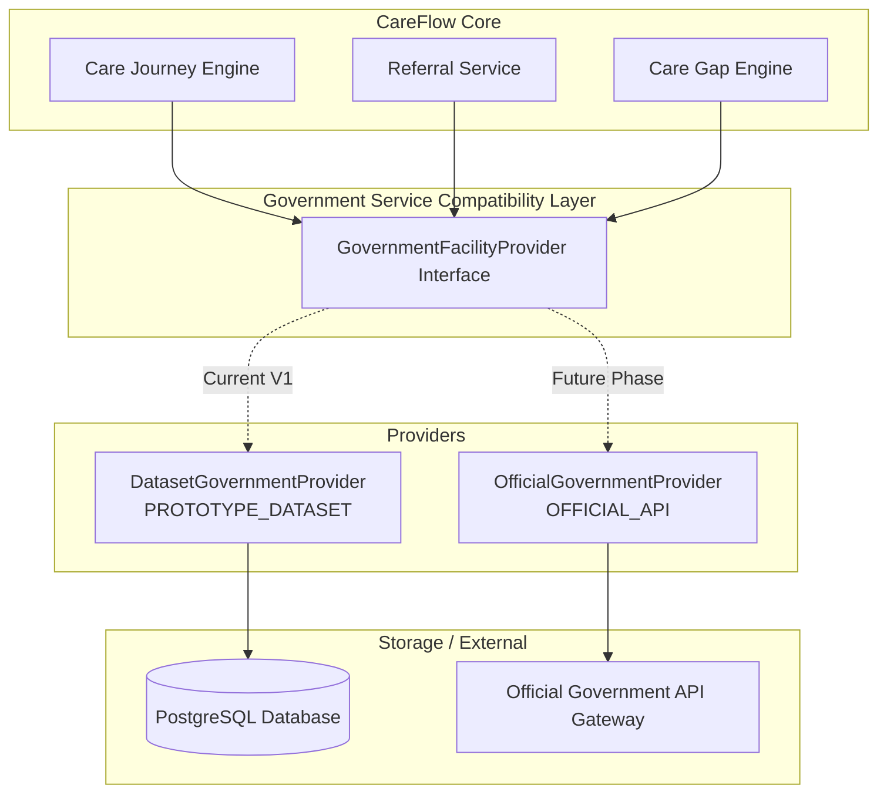

# Government Service Compatibility Layer Documentation

The **CareFlow Government Service Compatibility Layer** provides an interim integration interface connecting CareFlow Core to public healthcare facility directories and external government services.

---

## 1. Most Important Product Principle

> [!IMPORTANT]
> **CareFlow does NOT replace existing healthcare services.**
> CareFlow **ACCESSes** them, **CONNECTs** to them, **COORDINATEs** them, **TRACKs** the care journey, **IDENTIFIEs** care gaps, and **SUPPORTs** follow-up care. Existing healthcare facilities and providers remain fully responsible for providing actual clinical care.

---

## 2. Provider Architecture & Dependency Direction

The business logic in CareFlow Core depends strictly on interface contracts (`GovernmentFacilityProvider`), never directly on dataset files, raw SQL queries, or provider-specific implementations.

---

## 3. Integration Terminology Definitions

| Term | Operational Scope & Meaning |
| :--- | :--- |
| `REAL CAREFLOW API` | Production CareFlow backend endpoints executing native business rules (Journeys, Care Gaps, Tasks, Patients, Referrals). |
| `PROTOTYPE_DATASET` | Public/official Government of India OGD dataset snapshot stored in PostgreSQL and exposed via dataset-backed service providers. |
| `DEMO_TRANSACTION` | Simulated external transactions for integration boundaries where no authorized external API is currently available (Telemedicine, Diagnostics, Transport). |
| `OFFICIAL_API` | Reserved for future authorized live Government API integrations (e.g., ABDM, eSanjeevani Gateway). |

---

## 4. Extension Points for External Services

| Service Domain | Interface Contract | Adapter Mode | Default Contract Output |
| :--- | :--- | :--- | :--- |
| **Facility Directory** | `GovernmentFacilityProvider` | `PROTOTYPE_DATASET` | 6 OGD Public Facility Records in PostgreSQL |
| **Telemedicine** | `GovernmentTelemedicineProvider` | `DEMO_TRANSACTION` | Mock eSanjeevani Tele-consultation Request Response |
| **Referrals** | `GovernmentReferralProvider` | `DEMO_TRANSACTION` | Mock National Health Referral Response |
| **Diagnostics** | `GovernmentDiagnosticProvider` | `DEMO_TRANSACTION` | Mock National Health Lab Order Response |
| **Emergency Transport** | `GovernmentTransportProvider` | `DEMO_TRANSACTION` | Mock 108 Ambulance Fleet Dispatch Response |

---

## 5. REST Endpoints

- `GET /api/v1/gov/facilities` — Retrieve list of government facilities (optional `district`, `type`, `search` parameters).
- `GET /api/v1/gov/facilities/{id}` — Retrieve facility by NIN ID or primary key.
- `GET /api/v1/gov/integration/status` — Returns active provider mode (`PROTOTYPE_DATASET`), latency, invocation count, and metadata.
